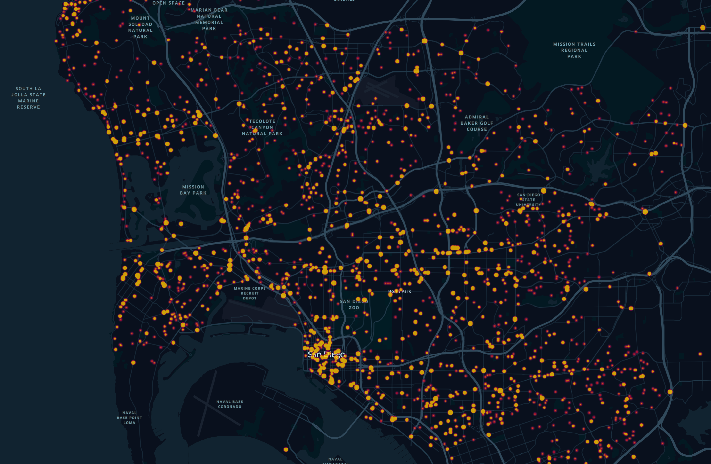

<b>Traffic Collision Data Visualization</b>

This project uses the traffic collision reports data (2017+) from the official San Diego government website. It will transform open data into coordinates using the OpenStreetMap (OSM) Nominatim geocoding API which can be used on Kepler.gl to visualize the heatmap of traffic collisions.

The OSM Nominatim API was chosen to be used to avoid fees from other geocoding providers. A local OSM Nominatim instance was installed using Docker on a Ubuntu 18.04 VM running on Hyper-V to avoid the potential throttling from the actual live website.

Screenshot Of Traffic Collision Data Visualization

Dataset: https://data.sandiego.gov/datasets/police-collisions/

OpenSteetMap Geocoding API: https://www.openstreetmap.org/

Visualization: https://kepler.gl/
